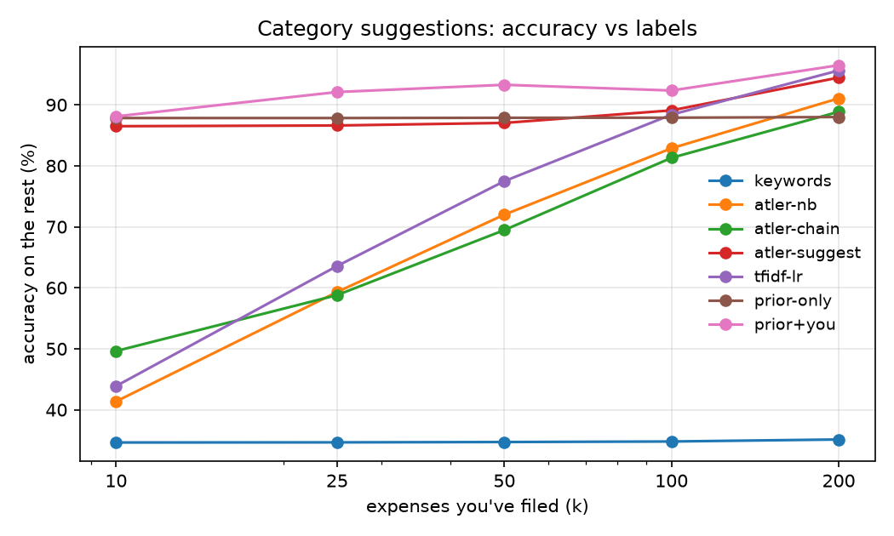

# atler-ml

[](https://github.com/KunalGITID/atler-ml/actions/workflows/ci.yml)

**Does machine learning beat the hand-written rules in [ATLER](https://github.com/KunalGITID/ATLER)?**

ATLER is my expense and subscription tracker. It runs entirely on the phone and has three "smart" features,
each built from heuristics:

| Feature | What ATLER does today | File in ATLER |
|---|---|---|
| Category suggestions | regex keyword hints, then a per-user Naive Bayes trained on what you've filed | `src/core/suggest.ts`, `classify.ts` |
| Subscription finder | groups a bank statement by merchant, matches the median gap to a billing rhythm | `src/core/import/statement.ts` |
| Unusual-spend alerts | Tukey's fence (Q3 + 1.5 IQR) on earlier spends in the same category | `src/core/insights.ts` |

This repo benchmarks each one against scikit-learn models on the same data, with the same rules about what the
model may see. The ATLER side is not a Python re-implementation: `bridge/atler.ts` imports ATLER's real
TypeScript core and runs it under Node, so the numbers describe the shipped code.

## Results

The tables show 40 synthetic users, one year each (35,371 transactions, seed 7). Full tables are in
[`results/RESULTS.md`](results/RESULTS.md). "Before" means ATLER at `c05ac87`; "after" means ATLER with #28–#30,
which came out of this repo. The shipped models were trained on seeds 101–103 and never saw these statements.



**1. Category suggestions** ([ATLER#30](https://github.com/KunalGITID/ATLER/pull/30)). Every user files their
first *k* expenses, and the model guesses the rest.

| accuracy (%) | k = 10 | 25 | 50 | 100 | 200 |
|---|---:|---:|---:|---:|---:|
| ATLER before (Naive Bayes, else keywords) | 49.6 | 58.8 | 69.5 | 81.3 | 88.8 |
| **ATLER after (shipped prior + your Naive Bayes)** | **86.5** | **86.6** | **87.0** | **89.1** | **94.5** |
| TF-IDF + logistic regression, yours only | 43.9 | 63.6 | 77.5 | 88.4 | 95.6 |
| prior + your own logistic regression (best here) | 88.1 | 92.1 | 93.3 | 92.3 | 96.5 |

- On-phone learning alone needs about 100 labels to become useful, and most people give up before filing 100 expenses.
- A prior trained on other people's statements works from the first expense, because Swiggy is Swiggy for
  everyone. It only keeps features seen in 3+ users' statements. Character n-grams cope with `SWIGGY*BLR`,
  `BUNDLTECHNOLOGIES` and similar mangled names.
- Your filing gets weight *k* / (*k* + 150). That was tuned on a training seed; with 20, accuracy dipped to 81%
  at 25–50 expenses because Naive Bayes on a handful of labels was trusted too early.
- What ATLER ships is 1,000 features, 81 KB of JSON (15.7 KB gzipped). Going from 8,000 features down to 1,000
  costs no accuracy; going down to 300 costs 17 points.

**2. Subscription finder** ([ATLER#29](https://github.com/KunalGITID/ATLER/pull/29)), over 154 real recurring series

| | precision | recall | F1 | cycle correct |
|---|---:|---:|---:|---:|
| ATLER before (rhythm rules) | 76.6 | 85.1 | 80.6 | 96.9 |
| rules + the name fix only | 78.5 | 94.8 | 85.9 | 99.3 |
| **ATLER after (name fix + shipped tree model)** | **96.1** | **96.1** | **96.1** | **100** |

- **The name fix.** `merchantName` kept bank words (`DR`, `Paid`, `PUR`), so `UPI/DR/…/ADITYA NAIR` and
  `Paid to ADITYA NAIR` counted as two different payees. A monthly rent was cut into pieces with broken gaps.
- **The model.** Gradient boosting (80 trees, depth 3) over 11 *regularity* features: gaps, steady amounts, and
  day-of-month spread. Price and merchant are deliberately not features. ATLER's rhythm table still names the
  cycle. The features are computed by ATLER's own TypeScript through the bridge, so training and the app share
  one implementation. The exported trees (30 KB) match scikit-learn to within 1e-7.
- On seeds 11 and 23, F1 went from 85 to 98 and from 85 to 98.

**3. Unusual spending** (277 planted anomalies, 4 to 10 times a merchant's usual amount)

| | precision | recall | PR-AUC | alerts per user per year |
|---|---:|---:|---:|---:|
| ATLER at `c05ac87` (by category) | 10.4 | 84.5 | 14.4 | 56 |
| ATLER after #28 (same merchant) and #29 (name fix) | 16.1 | 70.8 | **65.6** | 30 |
| Isolation Forest | 45.0 | 39.0 | 43.4 | 6 |

#28 stopped comparing against the category: alerts judged against a category were only 7% real, because a big
DMart shop looks "unusual" next to small corner-shop runs. The name fix in #29 made merchant groups cleaner,
which raised ranking quality again (PR-AUC 45 → 66). But at its 2× bar, ATLER still raises 30 alerts per user
per year and 5 in 6 are false. Precision depends almost entirely on that bar:

| alert when at least | 2× | 2.5× | 3× | 3.5× | 4× |
|---|---:|---:|---:|---:|---:|
| precision | 16 | 27 | 47 | 68 | **83** |
| recall | 71 | 70 | 68 | 66 | 62 |
| alerts per user per year | 30 | 18 | 10 | 7 | 5 |

That table is *not* a reason to ship 4×. The anomalies are planted at 4–10×, so a 4× bar fits the generator by
construction. Real spending will be noisier for some merchants (Amazon) and steadier for others (metro fares). The
honest route to 80%+ precision is to measure it on real alerts, as described under **Next**.

## Caveats

- **The data is synthetic.** ATLER keeps money data on the phone and real statements are private, so
  `src/atler_ml/synth.py` generates statements in the style ATLER imports: UPI, POS and NACH narrations, legal
  names that differ from brand names (Bundl = Swiggy, Eternal = Zomato), posting delays, price rises,
  cancelled plans, and local shops unique to each user. The shipped models are trained on other seeds of the
  same generator, so every "after" number is in-distribution, and real-world numbers will be lower. In particular:
  - The category prior only knows the brands in the generator, plus generic words like *medicals* and *stores*.
  - The anomaly numbers depend on how much everyday amounts vary.
- The anomalies are *planted*, so "recall" means recall of this one kind of anomaly.
- The tables use seed 7. The subscription and suggestion results were re-checked on seeds 11 and 23.

## Run it

Needs Python 3.12 with [uv](https://docs.astral.sh/uv/), Node 23 or newer, and an ATLER checkout (by default
next to this repo, or wherever `ATLER_DIR` points).

```sh
git clone https://github.com/KunalGITID/ATLER ../ATLER
uv sync
uv run pytest
uv run python -m atler_ml.bench          # full run, about 2 min; writes results/
uv run python -m atler_ml.bench --quick  # 8 users, as in CI
uv run python -m atler_ml.export subscriptions   # retrain + write ATLER's subscriptionModel.json
uv run python -m atler_ml.export category-prior  # retrain + write ATLER's categoryPrior.json
```

## Layout

```
bridge/atler.ts          runs ATLER's TypeScript core on JSON jobs
src/atler_ml/synth.py    synthetic statements + ground truth
src/atler_ml/categorise.py, recurring.py, anomaly.py   one file per task
src/atler_ml/prior.py    the category prior's featurizer (mirrored in ATLER's categoryPrior.ts)
src/atler_ml/export.py   trains the models ATLER ships and writes them into an ATLER checkout
src/atler_ml/bench.py    runs everything, writes results/RESULTS.md
```

## Next

- **Unusual spend to 80%+ precision, measured on real alerts.** Add "Expected" / "Not expected" buttons to the
  card and keep the answers on the phone. Then (1) report real precision, (2) raise the bar per merchant you've
  marked "expected", and (3) once there are enough answers, learn the bar per user. The table above shows the
  lever exists: on this data the bar alone moves precision from 16% to 83%. Real feedback is what can set it
  without fitting the generator.
- Variance-aware scoring: compare against each merchant's own spread (MAD of log amounts) instead of one
  multiple for every merchant. This matters once real data has steady and erratic merchants.
- Forecasting: compare ATLER's 6-month mean against seasonal-naive and ETS, with backtested interval coverage.
- Results across 5 seeds, with confidence intervals.
- Model card for the shipped category prior.
